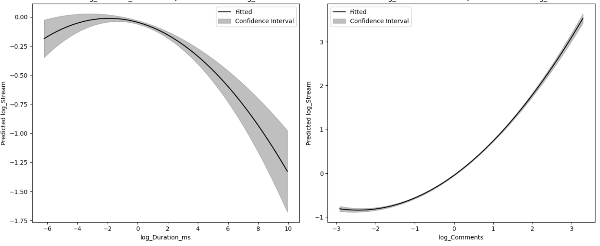
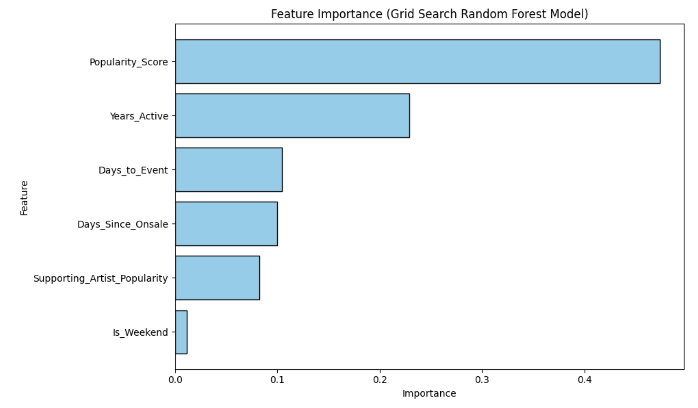
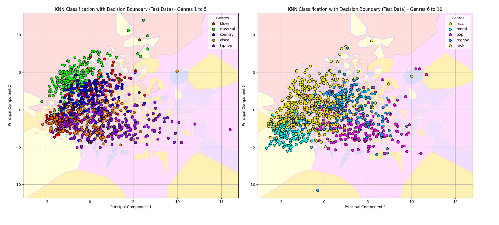

## Projects
-----
### Music Streams Prediction Model 

This project analyzes Spotify and YouTube data to predict song popularity using a regression model. With over 20,000 records and 27 features, I identified key drivers like comments, acoustic attributes, and optimal duration through feature selection methods such as Boruta SHAP and VIF. The model incorporates interaction and non-linear terms to reveal nuanced relationships between musical features and engagement. Insights from this project support data-driven strategies for production, marketing, and playlist curation, empowering stakeholders to optimize audience engagement and streaming success.

          

  

    
<strong>Effect of Duration and Comments on Streams</strong>

    
  

  

    
<strong>Correlation Plot of Features</strong>

    
  

-----

### Music Streams Prediction Calculator

The interactive Streams Prediction Calculator extends the prediction model's utility, allowing users to input song features and receive real-time streaming predictions through a cloud-hosted interface. This tool empowers music industry stakeholders to optimize production, marketing, and playlist strategies with data-driven insights.

  
<strong>Demo</strong>

  <video controls style="width: 60%; max-width: 300px; height: auto;">
    <source src="assets/Calc_demo.mov" type="video/quicktime">
    Your browser does not support the video tag.
  </video>

-----

### Dynamic Concert Ticket Price Prediction Model

I created a custom dataset to train a predictive model for concert ticket pricing, incorporating factors like artist popularity, event timing, and supporting acts. Through analysis and model development, I identified key drivers of ticket prices and provided actionable insights into pricing strategies. Additionally, I developed a Dynamic Ticket Price Calculator, a user-friendly tool that allows users to input event details and receive instant price predictions. This project empowers stakeholders in the events industry to optimize revenue and enhance decision-making with data-driven strategies.

  <!-- Video Section -->
  

    
<strong>Demo</strong>

    <video controls style="width: 100%; height: auto;">
      <source src="assets/demo.mov" type="video/quicktime">
      Your browser does not support the video tag.
    </video>
  

  <!-- Image Section -->
  

    
<strong>Important Features</strong>

    
  

-----
### Music Genre Classification Model

In this project, I built a machine learning model to classify songs into genres based on their audio features, such as tempo, rhythm, and frequency, which were extracted from audio files. I identified key characteristics that distinguish genres and trained a predictive model to achieve accurate classifications, showcasing the power of data-driven approaches in understanding and organizing music. This work has applications in music recommendation systems, playlist curation, and audience engagement strategies for the music industry.

  <!-- Left Image Section -->
  

    
<strong>Audio Feature Visualizations</strong>

    
  

  <!-- Right Images Section -->
  

    <!-- Top Right Image -->
    

      
<strong>Prediction Accuracy Matrix</strong>

      
    

     <!-- Bottom Right Image -->
    

      
<strong>Decision Boundaries</strong>

      
    

  

-----
### YouTube Comments Sentiment Analysis
-----
### Automated Music Metrics Extraction 
-----
